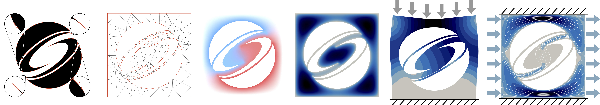

# TriWild: Robust Triangulation With Curve Constraints


Yixin Hu, Teseo Schneider, Xifeng Gao, Qingnan Zhou, Alec Jacobson, Denis Zorin, Daniele Panozzo.
ACM Transactions on Graphics (SIGGRAPH 2019).

## Dataset
### Examples in the Paper

Download [zip](https://drive.google.com/file/d/13xZqYpBz1cV1JaakgkcSO6hSbV9or5V4/view?usp=sharing).

💡💡💡Quickly try TriWild on some small exmaples here!!

### 20k Openclip Dataset

Input(todo): [19686 meshes (.obj) each with a curved feature file (.json)]()

Output with curved constrains: [19685 meshes (.msh)](https://drive.google.com/open?id=189OP5v5EJNP9QMqpWw_XuGRK_MjMThuJ)

Output with linear constrains(todo James): [19686 meshes (.msh)]()

## Installation

You can use TriWild either by pulling a Docker image or compiling the source code with CMake.

### via Docker

Install Docker and run Docker. Pull TetWild Docker image and run the binary:

```bash
docker pull yixinhu/triwild
docker run --rm -v "$(pwd)":/data yixinhu/triwild [TriWild arguments]
```

### via CMake
Our code was originally developed on MacOS and has been tested on Linux and Windows. We provide the commands for installing TriWild in Unix OS: 

- Clone the repository into your local machine:

```bash
git clone https://github.com/wildmeshing/TriWild
```
- Compile the code using cmake (default in Release mode):

```bash
cd TriWild
mkdir build
cd build
cmake ..
make -j
```

- Check the installation:

```bash
./TriWild --help
```
This command should show a list of TriWild parameters.

## Usage

**Input**：

- Linear constraints (required): segment soup in `.obj` format.

- Curved constraints: Bezier curves in `.json` format.

**Output**: Linear/high-order triangle mesh in `.msh` format.

Please check dataset above for examples.

### Quick Try

You can try TriWIld quickly with default parameters by running

```
./TriWild --input input.obj
```
for linear constrains, or

```
./TriWild --input input.obj --feature-input input.json
```
for curved constrains.

### Command Line Switches

```
Usage: ./TriWild [OPTIONS]

Options:
  -h,--help                   Print this help message and exit
  --input TEXT (REQUIRED)     Input segments in .obj format.
  --output TEXT               Output path.
  --postfix TEXT              Add postfix into outputs' file name.
  --feature-input TEXT        Input feature json file.
  --stop-quality FLOAT        Specify max AMIPS energy for stopping mesh optimization.
  --max-its INT               Max number of mesh optimization iterations.
  --stage INT                 Specify envelope stage
  --envelope-r FLOAT          relative envelope epsilon_r. Absolute epsilonn = epsilon_r * diagonal_of_bbox
  --feature-envelope-r FLOAT  Relative feature envelope mu_r. Absolute mu = mu_r * diagonal_of_bbox
  --target-edge-length FLOAT  Absolute target edge length l.
  --target-edge-length-r FLOAT
                              Relative target edge length l_r. Absolute l = l_r * diagonal_of_bbox
  --log-file TEXT             Output a log file.
  --min-angle FLOAT           Desired minimal angle.
  --mute-log                  Mute prints.
  --cut-outside               Remove "outside part".
  --skip-eps                  Skip saving eps.
  --cut-holes TEXT            Input a .xyz file for specifying points inside holes you want to remove.
  --output-linear-mesh        Output linear mesh for curved pipeline.
```

More details about some important parameters:

* **`--feature-input`**

We provide a [python script](https://github.com/teseoch/svg2obj) for converting a svg to curves in `.json` format.

* **`--envelope`**

Relative surface envelope <a href="https://www.codecogs.com/eqnedit.php?latex=$\epsilon_r$" target="_blank"></a> (1e-3 in default). Absolute surface envelope <a href="https://www.codecogs.com/eqnedit.php?latex=$\epsilon&space;=&space;\epsilon_r&space;d$" target="_blank"></a>, where <a href="https://www.codecogs.com/eqnedit.php?latex=$d$" target="_blank"></a> is the length of the diagonal of the bounding box of input.

* **`--feature-envelope`**

Relative feature envelope <a href="https://www.codecogs.com/eqnedit.php?latex=$\mu_r$" target="_blank"></a> (1e-3 in default with linear constraints and 2e-3 for curved constraints). Absolute feature envelope <a href="https://www.codecogs.com/eqnedit.php?latex=$\mu&space;=&space;\mu_r&space;d$" target="_blank"></a>.

* **`--target-edge-length-r`**

Relative targeted edge length <a href="https://www.codecogs.com/eqnedit.php?latex=$\ell_r$" target="_blank"></a> (0.05 in default). Absolute targeted edge length <a href="https://www.codecogs.com/eqnedit.php?latex=$\ell&space;=&space;\ell_r&space;d$" target="_blank"></a>.

## License

TriWild is MPL2 licensed and free for both commercial and non-commercial usage. However, you have to cite our work in your paper or put a reference of TriWild in your software. Whenever you fix bugs or make some improvement of TriWild, you should contribute back.

## Gallery


<!--## Acknowledgements

(todo)-->
